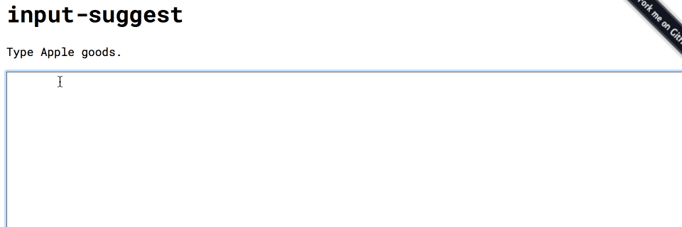

# input-suggestion

[](https://circleci.com/gh/1000ch/input-suggestion)
[](http://badge.fury.io/js/input-suggestion)
[](https://david-dm.org/1000ch/input-suggestion)
[](https://david-dm.org/1000ch/input-suggestion#info=devDependencies)

Show suggestions when you input.



## Install

Using npm:

```sh
$ npm install input-suggestion
```

Using bower:

```sh
$ bower install input-suggestion
```

## Usage

```html
<textarea></textarea>
<script>
  var is = new InputSuggest('textarea');
  is.setSuggestions(['Apple', 'Apple Watch', 'Mac', 'iPad', 'iPhone', 'iPod', 'iPod Touch']);
</script>
```

## Customize popup

You can style popup with following HTML structure.

```html
<ul class="suggestion is-shown">
  <li class="suggestion__item is-selected">Item1 is selected</li>
  <li class="suggestion__item">Item2</li>
  <li class="suggestion__item">Item3</li>
</ul>
```

## License

MIT: http://1000ch.mit-license.org
